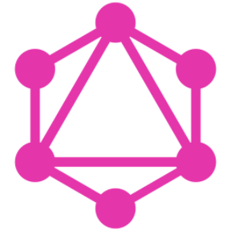

### Hi, I'm Genadi 👋

I'm Computer Science student and Full Stack Web Developer, looking to extend my knowledge as much as I can and gain experience solving interesting problems while working with cool people.
 

<a id="raw-url" href="https://raw.githubusercontent.com/genadi53/genadi53/main/files/Genadi_Tsolov_CV.pdf">Check out my CV</a>

## Contact with me

  

<!-- ## Languages and Tools

<a href="https://www.w3schools.com/css/" target="_blank"> 

 -->

 

  Coding Stats

  

  
  

<!-- 

 -->
